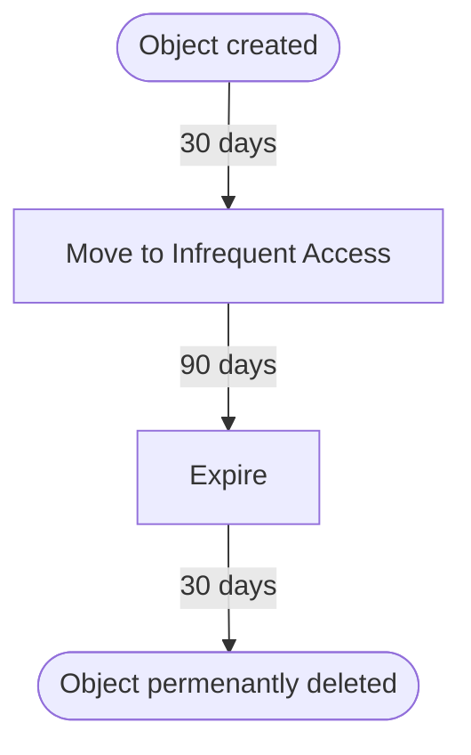

# AWS Logging Module

[![Main Checks][badge-checks]][code-checks] [![GitHub Release][badge-release]][latest-release]

This module created an S3 bucket for logging, as well as a KMS for CloudWatch
logs.

> [!NOTE]
> The bucket created by this module uses AES256 encryption. CMKs (Customer
> Managed Keys) are [not supported] for access logging.

## Usage

> [!CAUTION]
> Version 2.0.0 introduces a breaking change. Be sure to following the upgrade
> instructions in the [CHANGELOG][changelog-2.0] before upgrading from a prior
> version.

Add this module to your `main.tf` (or appropriate) file and configure the inputs
to match your desired configuration. For example:

```hcl
module "logging" {
  source = "github.com/codeforamerica/tofu-modules-aws-logging?ref=2.0.0"

  project     = "my-project"
  environment = "dev"
}
```

Make sure you re-run `tofu init` after adding the module to your configuration.

```bash
tofu init
tofu plan
```

To update the source for this module, pass `-upgrade` to `tofu init`:

```bash
tofu init -upgrade
```

## Log retention

CloudWatch log retention can be set independently for each log group. See the
[log_groups] input for more information.

S3 logs follow a lifecycle policy that moves logs to the [infrequent
access][infrequent-access] storage class before they eventually expire. The flow
chart below shoes the lifecycle of an object using the default settings.



For more information on S3 object lifecycles, see the AWS documentation on
[object lifecycle management][lifecycle-management].

## Inputs

| Name                         | Description                                                                             | Type           | Default        | Required |
|------------------------------|-----------------------------------------------------------------------------------------|----------------|----------------|----------|
| project                      | Name of the project.                                                                    | `string`       | n/a            | yes      |
| bucket_suffix                | Adds a random suffix to the bucket name.                                                | `bool`         | `false`        | no       |
| cloudwatch_log_retention     | Number of days to retain logs in CloudWatch.                                            | `number`       | `30`           | no       |
| environment                  | Environment for the project.                                                            | `string`       | `"dev"`        | no       |
| key_recovery_period          | Number of days to recover the KMS key after deletion.                                   | `number`       | `30`           | no       |
| [log_groups]                 | List of CloudWatch log groups to create.                                                | `list(string)` | `[]`           | no       |
| log_groups_to_datadog        | Send CloudWatch logs to Datadog. The Datadog forwarder must have already been deployed. | `bool`         | `true`         | no       |
| object_expiration            | Age (in days) before logs in S3 are expired.                                            | `number`       | `90`           | no       |
| object_ia_age                | Age (in days) before logs in S3 are moved to to the infrequent access storage tier.     | `number`       | `30`           | no       |
| object_lock_age              | Age (based on the lock period) of an object before the lock is removed.                 | `number`       | `30`           | no       |
| object_lock_mode             | [Object lock mode][lock-mode] for the bucket.                                           | `string`       | `"GOVERNANCE"` | no       |
| object_lock_period           | Period for which objects are locked. Valid values are "days" or "years".                | `string`       | `"days"`       | no       |
| object_noncurrent_expiration | Age (in days) before non-current versions of logs in S3 are expired.                    | `number`       | `30`           | no       |
| tags                         | Optional tags to be applied to all resources.                                           | `list`         | `[]`           | no       |

### log_groups

You can specify a list of CloudWatch log groups to create, with customized
options for each log group. If no `retention` is specified, the value provided
to `cloudwatch_log_retention` will be used.

```hcl
log_groups = {
  "/sample/log/group" = {},
  "waf" = {
    name = "aws-waf-logs-cfa/waf/demo"
    tags = { source = "waf" }
  }
}
```

The following options are available for each log group:

| Name      | Description                                                                      | Type          | Default                        | Required |
|-----------|----------------------------------------------------------------------------------|---------------|--------------------------------|----------|
| class     | Storage class for the log group. Options are `STANDARD` and `INFREQUENT_ACCESS`. | `string`      | `"STANDARD"`                   | no       |
| name      | Name of the log group. Defaults to the key from the map.                         | `string`      | `each.key`                     | no       |
| retention | Retention period for logs.                                                       | `string`      | `var.cloudwatch_log_retention` | no       |
| tags      | Map of tags to add to the log group. Will be merged with `tags`.                 | `map(stirng)` | `{}`                           | no       |

## Outputs

| Name               | Description                                      | Type          |
|--------------------|--------------------------------------------------|---------------|
| bucket             | S3 bucket used to store logs.                    | `string`      |
| bucket_domain_name | Domain name of the S3 bucket used to store logs. | `string`      |
| datadog_lambda     | ARN of the Datadog lambda forwarder, if in use.  | `string`      |
| kms_key_alias      | Alias of the KMS key used to encrypt logs.       | `string`      |
| kms_key_arn        | ARN of the KMS key used to encrypt logs.         | `string`      |
| log_groups         | ARNs of any created CloudWatch log groups.       | `map(string)` |

[badge-checks]: https://github.com/codeforamerica/tofu-modules-aws-logging/actions/workflows/main.yaml/badge.svg
[badge-release]: https://img.shields.io/github/v/release/codeforamerica/tofu-modules-aws-logging?logo=github&label=Latest%20Release
[changelog-2.0]: CHANGELOG.md#200-2025-02-28
[code-checks]: https://github.com/codeforamerica/tofu-modules-aws-logging/actions/workflows/main.yaml
[infrequent-access]: https://docs.aws.amazon.com/AmazonS3/latest/userguide/storage-class-intro.html#sc-infreq-data-access
[latest-release]: https://github.com/codeforamerica/tofu-modules-aws-logging/releases/latest
[lifecycle-management]: https://docs.aws.amazon.com/AmazonS3/latest/userguide/object-lifecycle-mgmt.html
[lock-mode]: https://docs.aws.amazon.com/AmazonS3/latest/userguide/object-lock.html#object-lock-retention-modes
[log_groups]: #log_groups
[not supported]: https://repost.aws/knowledge-center/s3-server-access-log-not-delivered
